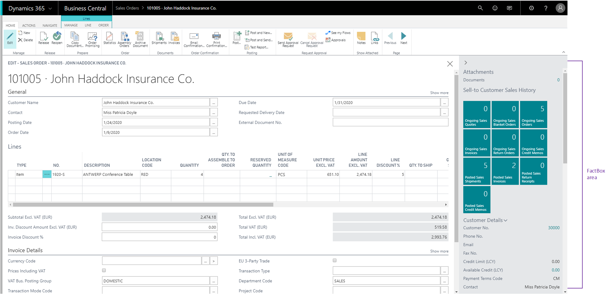

# Adding a FactBox to a Page
A FactBox is the area that is located on the right-most side of a page and it is divided into one or more parts that are arranged vertically. This area is used to display content including other pages, charts, and system parts such as Microsoft Outlook, Notes, and Record Links. Typically, you can use a FactBox to display information that is related to an item on the main content page. For example, on a page that shows a sales order list, you can use a FactBox to show sell-to customer sales history for a selected sales order in the list as shown below.  

  

The following list highlights a few categories of FactBoxes:

- Show related records/fields which are modeled as ListParts or CardParts.
- Show related KPIs which are modeled as CardParts with charts or Cues. For more information, see [Designing Role Centers](devenv-designing-role-centers.md).
- Visualize related data or display from external sources which are modeled as CardParts containing a Client AddIn. For example, Bing maps, PowerBI, Microsoft Social Engagement, and more. 
  
## Adding a FactBox area to a page
You define the FactBox by adding a FactBox area container control to the page. The FactBox area control acts as a placeholder to which you can add different parts for the FactBox. You can add a FactBox area control on the following page types. 
  
-   Card  
  
-   Document  
  
-   List  
  
-   ListPlus  
  
-   Navigate  
  
-   Worksheet 

> [!NOTE]  
> Only one FactBox area control is allowed on a page. 

> [!WARNING]  
> You can add a part to the FactBox area that displays an existing page of the CardPart or ListPart type only. If you attempt to use another page type, you will get an error. 

### Example

```
page 50100 "Simple Customercard Page"
{
    PageType = Card;
 
    layout
    {
        area(FactBoxes)
        {
            part(MyPart; "Acc. Sched. KPI Web Srv. Lines")  { }

            systempart(Links; Links)  { } 
         
            systempart(Notes; Notes)  { }         
        }
    }
}
```
> [!TIP]  
> When used on Lists, Factboxes can be used to show information about the entire list, or more contextually about the user’s current selection; the currently selected rows. You can control the filter which gets passed to the FactBox that determines its contextual contents. 

## Filtering data that is Displayed on a Page in a FactBox
In many cases, you want to change the content that is displayed on the page in the FactBox based on the content of the main page. For example, if the main page is a Customer List, you can have a FactBox that includes the Customer Details page that shows information about a customer. When a user selects a customer in the Customer List, the Customer Details page displays information about the selected customer. To implement this functionality, you set up a table filter that associates a field in the table that is used by the Customer Details page with a field in the table that is used by the Customer List page. You can also filter on a constant value or set of conditions. 

## See Also  
[Pages Overview](devenv-pages-overview.md)   
[Designing Role Centers](devenv-designing-role-centers.md)  
[Using Designer](devenv-inclient-designer.md)  
[Arranging Rows and Columns on a Fasttab]()  
[Actions Overview](devenv-actions-overview.md)

