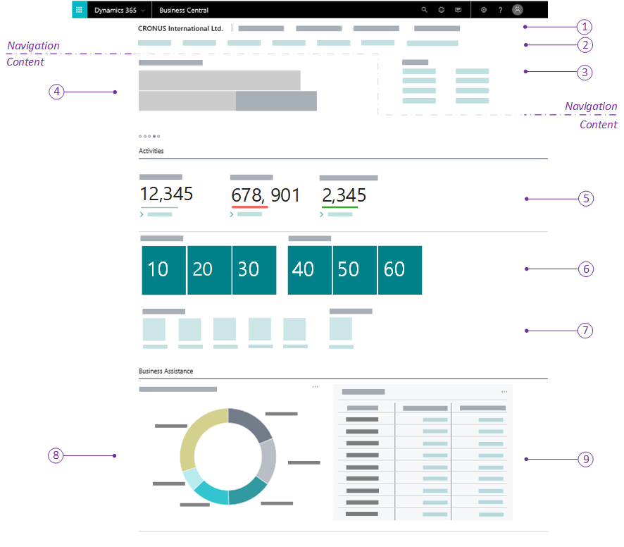

[!INCLUDE[newdev_dev_preview](includes/newdev_dev_preview.md)]

# Designing Role Centers
The Role Center is the users entry point and home page for [!INCLUDE[d365fin_md](includes/d365fin_md.md)]. You can develop several Role Centers, where each Role Center is customized to the users' profile. For example, you could have a Rolce Center for sales order processors, business managers, administrators and more. A Role Center should be designed to give users quick access to the information that is most important to them in their daily work.

## Overview
A Role Center is defined by a `RoleCenter` page type. The Role Center page is divided into two main areas: navigation area and page parts area.



## Navigation area
The navigation area appears at the top of the Role Center page, and provides links to other objects, such as pages, reports, and codenits, and more. You define the navigation area by adding actions to the Role Center page. By using the Depending on the subtype The following table describes the elements in the navigation area:

||Element|Description|More information|
||-------|-----------|----------------|
|1|Navigation bar|These items are defined by an `ActivityButton` control. ||
|2|Home menu|These items are defined by a `HomeItems` control||
|3|Action menu|These items are defined by an `ActionsItems` control||


The Navigation Pane appears on the left side of the [!INCLUDE[d365fin_long_md](includes/d365fin_long_md.md)] window, and contains multiple sections that enable users to quickly navigate and perform actions in [!INCLUDE[d365fin_long_md](includes/d365fin_long_md.md)]. A single section in the Navigation Pane can be defined as a menu group that contains multiple sub-menu items. 


The Navigation Pane displays the Home menu items by default; the other menu items can be accessed by clicking on the small drop-down arrow placed next to the *selected* menu category in [!INCLUDE[d365fin_long_md](includes/d365fin_long_md.md)]. For users, the menu groups that display in the Navigation Pane could change depending on the Role Center page that they access. 

### Example
The example below explains how to add the menu group called `My New Action Group` to the Navigation Pane. The sub-menu items for the `My Customers` contains the actions which are named as `Customer Bank Account List` and `Customer Ledger Entries`, each opening the equivalent page object. In this example, the `My Customers` will appear on the Navigation Pane for the **Sales Order Processor** Role Center. 

```al
pageextension 50120 ExtendNavigationPane extends "Order Processor Role Center"
{

    actions
    {
        addlast(Sections)
        {
            group("My Customers")
            {
                action("Customer Bank Account List")
                {
                    RunObject = page "Customer Bank Account List";
                    ApplicationArea = All;
                }
                 action("Customer Ledger Entries")
                {
                    RunObject = page "Customer Ledger Entries";
                    ApplicationArea = All;
                }
            }
        }
    }
}
```

You can also enable pages and reports to appear in the [!INCLUDE[d365fin_long_md](includes/d365fin_long_md.md)] search for a quick navigational support. For more information, see [Adding Pages and Reports to Search](devenv-al-menusuite-functionality.md).

## Page part area
The page part area specifies the content that appears on the Role Center. The page part area consists of one or more parts that are defined by an :


|Element|Description|More information|
|-------|-----------|----------------|
|4|A HeadlinePart page for displaying headlines. |[Creating Role Center Headlines](devenv-create-role-center-headline.md)|
|5|Wide cue for displaying large values|[Cues](devenv-cues-action-tiles.md)|
|6|Normal cue for displaying |[Cues](devenv-cues-action-tiles.md)|
|7|Action tiles |[Action Tiles](devenv-cues-action-tiles.md)|
|8|These items are defined by a `HomeItems` control||

## See Also
[AL Development Environment](devenv-reference-overview.md)  
[Page Extension Object](devenv-page-ext-object.md)  
[Actions Overview](devenv-actions-overview.md)  
[Adding Pages and Reports to Search](devenv-al-menusuite-functionality.md)  